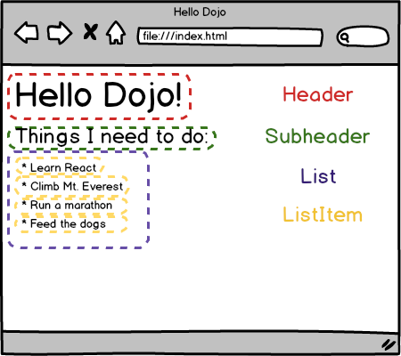
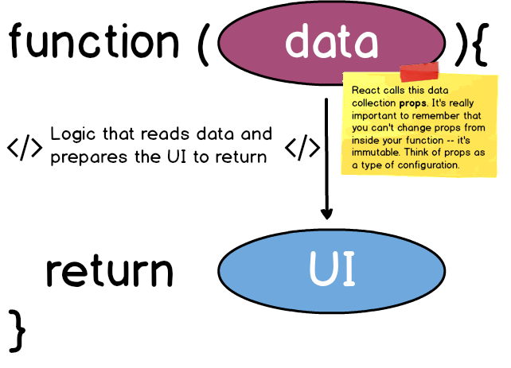

## React Components
So far we've just been creating React __elements__, but we'd really like to take advantage of __components__.

### But what are components?

Think of components as a chunk of code (read `function`!) that's entirely responsible for a particular section of our app.  One of the great things about component-based architecture is the way it makes you think as a front-end developer.

For example, we could have organized our *Hello Dojo* mockup into the following components:


Now, why is it important to add this component concept to our mental model of front-end apps? Because our entire project is going to be organized in terms of components. That means the logic, markup and styling can all live in the same function, an architectural decision that will pay huge dividends as our app grows in complexity. That's because components let you split the UI into independent, reusable pieces, and consider each piece in isolation.

The markup, view logic, and often styling is all housed in one place. This feature makes React components reusable.
### A component is just a function

For now, think of a component as a JavaScript function that adheres to the following pattern:


A component is a function that takes in data and spits out UI. In React, UI is just the object(s) that are output from createElement method calls. Since all our React components will spit out React __elements__, you can think of components as being "made of" elements.

While things will get more advanced, writing the code for a React component can be as simple as:
```js
const HeadlineComponent = (data) => {
    return React.createElement('h1', null, 'Hello Dojo!');
}
```
The above example uses an [arrow function](https://developer.mozilla.org/en-US/docs/Web/JavaScript/Reference/Functions/Arrow_functions), but we could have written it as:
```js
const HeadlineComponent = function(data){
    return React.createElement('h1', null, 'Hello Dojo!');
}
```
Two things you should notice about our `HeadlineComponent`:

1. The variable name is uppercase. That's a requirement of any React component that we create, so don't forget it!
2. We aren't making use of the `data` parameter! It's just hanging out while we hardcode `'Hello Dojo!'`. That's pretty lame, and something we're about to rectify.

And since we're in React-land, we should use React's vocabulary. Instead of naming that parameter `data`, let's tweak it to `props`.
```js
const HeadlineComponent = (props) => {
    return React.createElement('h1', null, 'Hello Dojo!');
}
```
Component architecture gives us a consistency guarantee, much like what's called a pure function in programming:

With a given set of inputs, the output (how the component looks on the page) will always be the same.