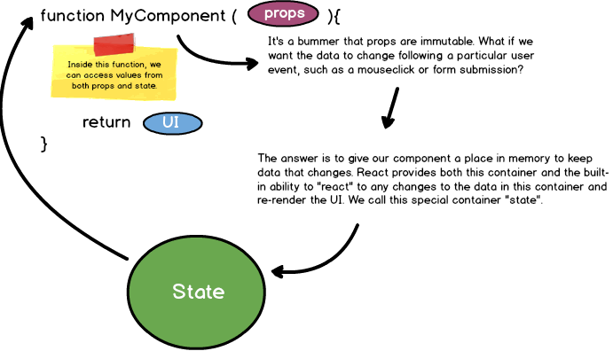

## Stateful Components

Brace yourself: We're about to add the missing puzzle piece that often makes developers fall in love with React.

We've already built components out of simple functions and built data-driven UI by passing `props` from parent to child components. But the whole __point__ of React -- and the reason for its name -- is the ability to react to state changes.

### What is state?

If you've had any programming experience, you're probably already familiar with the concept of application state. In web development, it just refers to a collection of data that:
- can change over time
- our code needs to reference to decide what should show up on the screen 

And so far, we've neglected to integrate the concept of state into our React application. That changes now.

### Stateful components



Sometimes our components, rather than being simple functions, need a designated place in memory to keep track of data. React developers generally create these juiced-up components in one of two ways:
- Using the `React.createClass()` method
- Using JavaScript's `class` keyword to extend `React.Component`

Before we go any further, remember: This is still a component, and so it must return UI. We'll accomplish that by giving app the one method it is required by React to have: `render`.

Just adding a `render` method is really no different than the stateless components you've already worked with; the major difference is that we've set ourselves up to use state. In React, while `props` are immutable and owned by a component’s parent, state is owned by the component itself and can be changed. To set up initial state, it must first be defined in a constructor method, this state can be referenced in our `rende`r method.

#### If you haven't yet reviewed JavaScript's `class` syntax, including `constructor` and `super`, now would be a good time. ([Link to documentation](https://developer.mozilla.org/en-US/docs/Web/JavaScript/Reference/Classes))

Now all we need to do is trigger a change in our state. Using React's setState method allows us to both change state and rerender UI.

```jsx
class App extends React.Component {
    constructor(props){
        super(props);
        this.state = {
            text: 'Stateful component!'
        }
    }
    render(){
        return (
            <div>
                <h1>{this.state.text}</h1>
                <button
                    onClick={ () => this.setState({ text: 'State has changed!' }) } >
                    Click to change state's text value!
                </button>
            </div>
        )
    }
}
```
### Things to remember:
- One of the most important things you can ask yourself as you're developing an app is: What data belongs in state?
- Every stateful component must have a render method, and every render method must return markup (or null)
- In React, native HTML elements always start with a lowercase letter whereas React component names always start with an uppercase letter
- You should always treat state as __immutable__
- State can only be updated __from within__ the component in which it lives. That means that if a child component needs to update a parent's state, the parent should pass a callback function down to the child as a `prop`.
---
### Additional resources
- [Thinking in React](https://facebook.github.io/react/docs/thinking-in-react.html)
- [ES6 `class` keyword](https://developer.mozilla.org/en-US/docs/Web/JavaScript/Reference/Classes)
- [`setState`](https://facebook.github.io/react/docs/react-component.html#setstate)
- [Why call `super` inside React `constructor`?](http://cheng.logdown.com/posts/2016/03/26/683329)
- [Visual Guide to State](https://daveceddia.com/visual-guide-to-state-in-react/)

---

## [Next ->](../01.Lessons/13.create-react-app.md)