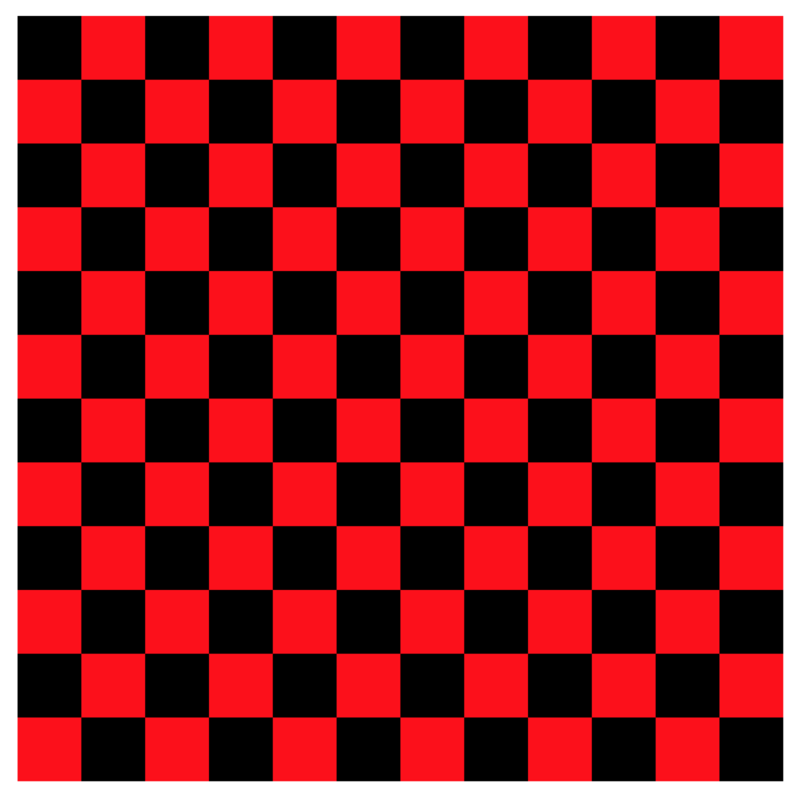

## Assignment: React Checkerboard

Build a React application that prompts a user for a number of rows, and then render the corresponding checkerboard. For example, a user entering "12" into the prompt would see the following in the browser. For an added challenge, have the user provide the checkerboard colors.



How many components will you use? The following code might be a helpful guide to getting started. Notice that the "components" are written in the style of stateless functional components.
```js
function CheckerBoard (props) {
  return /*Some UI... perhaps a list of rows?*/
}
function Row (props) {
  return /*Some UI... perhaps a list of cells?*/
}
function Cell (props) {
  return /*Some UI*/
}
// And feel free to use the following object:
var styles = {
    row: {height: '20px'},
    cell: {height: '20px', width: '20px', display:'inline-block'},
    colorA: {backgroundColor: 'black'},
    colorB: {backgroundColor: 'red'}
}
```

---

## [Next ->](../01.Lessons/10.PropEvents.md)