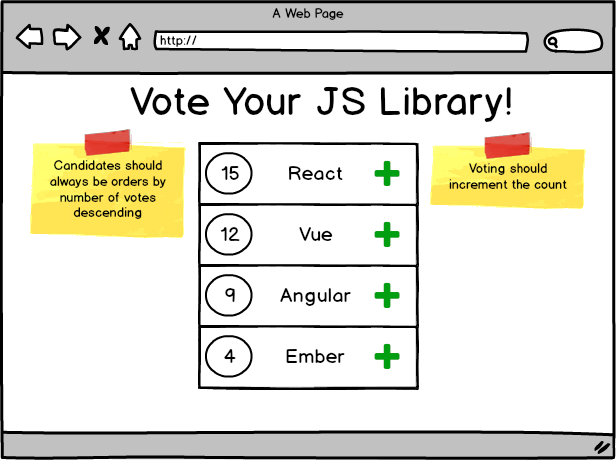

## Assignment: Voting App Pt. 1

Given the following data, create a React application using stateless functional components that accurately renders the mockup below.

- Don't worry (yet) about implementing the code that will increment votes.
- When a user clicks on the Plus icon, an alert should notify the user which library she voted for.
---

---

## [Next ->](../01.Lessons/11.StatefulComponents.md)